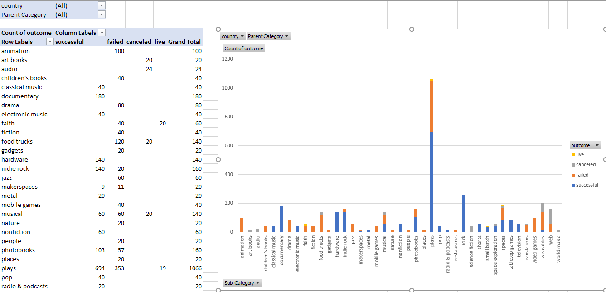

# Kickstart My Chart

## Background

Over $2 billion has been raised using the massively successful crowdfunding service, Kickstarter, but not every project has found success. Of the more than 300,000 projects launched on Kickstarter, only a third have made it through the funding process with a positive outcome.

Getting funded on Kickstarter requires meeting or exceeding the project's initial goal, so many organizations spend months looking through past projects in an attempt to discover some trick for finding success. For this week's homework, you will organize and analyze a database of 4,000 past projects in order to uncover any hidden trends.

## Instructions

Using the Excel table provided, modify and analyze the data of 4,000 past Kickstarter projects as you attempt to uncover some market trends.

* Use conditional formatting to fill each cell in the `state` column with a different color, depending on whether the associated campaign was successful, failed, or canceled, or is currently live.

  * Create a new column O called `Percent Funded` that uses a formula to uncover how much money a campaign made to reach its initial goal.

* Use conditional formatting to fill each cell in the `Percent Funded` column using a three-color scale. The scale should start at 0 and be a dark shade of red, transitioning to green at 100, and blue at 200.

  * Create a new column P called `Average Donation` that uses a formula to uncover how much each backer for the project paid on average.

  * Create two new columns, one called `Category` at Q and another called `Sub-Category` at R, which use formulas to split the `Category and Sub-Category` column into two parts.

  

  * Create a new sheet with a pivot table that will analyze your initial worksheet to count how many campaigns were successful, failed, canceled, or are currently live per **category**.

  * Create a stacked column pivot chart that can be filtered by country based on the table you have created.

  

  * Create a new sheet with a pivot table that will analyze your initial sheet to count how many campaigns were successful, failed, or canceled, or are currently live per **sub-category**.

  * Create a stacked column pivot chart that can be filtered by country and parent-category based on the table you have created.

* The dates stored within the `deadline` and `launched_at` columns use Unix timestamps. Fortunately for us, [there is a formula](http://spreadsheetpage.com/index.php/tip/converting_unix_timestamps/) that can be used to convert these timestamps to a normal date.

  * Create a new column named `Date Created Conversion` that will use [this formula](http://spreadsheetpage.com/index.php/tip/converting_unix_timestamps/) to convert the data contained within `launched_at` into Excel's date format.

  * Create a new column named `Date Ended Conversion` that will use [this formula](http://spreadsheetpage.com/index.php/tip/converting_unix_timestamps/) to convert the data contained within `deadline` into Excel's date format.

  

  * Create a new sheet with a pivot table with a column of `state`, rows of `Date Created Conversion`, values based on the count of `state`, and filters based on `parent category` and `Years`.

  * Now create a pivot chart line graph that visualizes this new table.

## Analysis

* One conclusion you can make about Kickstarter campaigns is that many of them aren’t successful at first. Based on this data, around 46% of the campaigns were either failed or canceled. Also, film & video, music, and theater seem to be the most popular and successful compared to other categories. The popularity is confirmed by the data, showing an outlier of 1066, where 694 of them were successful.

* Some limitations of the dataset are that the sample sizes are too small to make a confident conclusion about the success of Kickstarter campaigns in those specific categories. For instance, art books had a grand total of 20 but all 20 were canceled. If we were provided with 500 art book samples, it is safe to assume there would be 500 canceled.

* It would be interesting to see if there’s any correlation between the time of year and success rate by using the date created and ended conversions with a scatter plot. Also, we could use a bar chart that explicitly shows how many were successful, failed, canceled, and live.